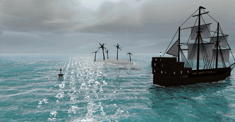

# Tideline

[](https://github.com/ProfRino/tideline/releases/latest)
[](LICENSE)
[](https://profrino.github.io/tideline/)

Tideline is a **procedural ocean and sky playground** for the browser. A
Gerstner-wave sea with real reflections and refraction, raymarched volumetric
clouds over a physically based scattering sky, an explorable underwater world,
rain that dimples the surface, and forked lightning — with six sea states
(**Calm, Azure, Golden, Rain, Storm, Tempest**) and live sliders for wind,
wave height, whitecaps, solar time, cloud cover and rain. Drag to orbit, and
dive below the surface to keep exploring.

Everything is generated **in shaders and code** — no textures, no 3D models,
no network requests — and the whole demo builds to a **single HTML file** that
runs entirely in your web browser.



---

## Features

Pure client-side — no installation, no backend. The build produces one
self-contained HTML file you can host anywhere or open from disk.

* **Gerstner-wave ocean.** Fourteen wave components with deep-water
  dispersion and travelling group envelopes, so swell arrives in sets that
  build and dissolve. Per-pixel analytic normals, Jacobian-based whitecaps,
  breaking shore wash, sun glitter, and crest subsurface scattering.
* **Real reflections and refraction.** A mirrored scene render gives true
  planar reflections; a second refraction pass lets you see the actual
  seabed, kelp and hull through the rippling surface, attenuated by a
  physically inspired water column.
* **Physically based sky.** Rayleigh/Mie scattering with a full day/night
  cycle, adapted from the MIT-licensed
  [three.js `Sky` example](https://threejs.org/examples/#webgl_shaders_sky) —
  plus stars, milky way, moon, sun halo and crepuscular rays at dusk.
* **Volumetric clouds.** A raymarched cumulus slab with self-shadowed
  bodies, silver linings, wind drift, and coverage from scattered fair-weather
  puffs to a ragged storm deck.
* **Weather.** Rain falls as velocity-aligned streaks, dimples the sea with
  expanding impact rings and splash crowns, darkens the whole atmosphere, and
  smears the horizon with distant rain curtains. Heavy rain builds forked
  lightning strikes that flash the cloud deck from inside.
* **Underwater world.** Orbit below the surface: a true Snell's-window view
  of the sky through the waves, total internal reflection streaked with
  caustics, a procedural sandy seabed with animated light webs, swaying kelp,
  and depth-based light absorption.
* **Procedural scene.** A three-masted galleon with a rigging web, billowed
  sails and a lamplit stern gallery; a palm-cay island continuous from beach
  to seabed; every prop generated in code.
* **Adaptive quality.** A four-step quality ladder (resolution, render-target
  sizes, simplified clouds) keeps the demo interactive on integrated GPUs.

## How to use it

You have **two equally simple ways** to run Tideline — both with no
installation, no account, and no server.

### Option 1 — Online

> **[Open it in your browser — profrino.github.io/tideline](https://profrino.github.io/tideline/)**

Just open the link in Chrome, Edge, Firefox, or Safari. That's it.

### Option 2 — Offline, on your own computer

Download **[Tideline-Standalone.html](https://github.com/ProfRino/tideline/releases/latest/download/Tideline-Standalone.html)**
— one single file — from the
[Releases page](https://github.com/ProfRino/tideline/releases). Save it
anywhere, then **double-click it**. The demo opens straight in your default
browser and works fully offline: no server, no install, nothing streamed.

## For developers

If you want to fork the code, audit it, or contribute changes:

* **Clone and build:**
  ```sh
  git clone https://github.com/ProfRino/tideline.git
  cd tideline
  npm install
  npm run build      # bundles src/ and regenerates Tideline-Standalone.html
  npm run dev        # watch mode; serve index.html with any static server
  ```
* **Where things live:** `src/tideline.js` holds the ocean, sky and
  underwater engine with all the shaders; `src/galleon.js` and
  `src/flora.js` build the procedural props; `build-standalone.mjs` inlines
  the bundle into the single-file build.
* The GitHub Actions workflow at `.github/workflows/pages.yml` redeploys the
  hosted demo on every push to `main`.

## Stack

[Three.js](https://threejs.org) + [esbuild](https://esbuild.github.io).
That's the whole stack. MIT-licensed.

## Citation

If you reference this work, please cite:

> Lovreglio, R. *Tideline*. Massey University.
> https://github.com/ProfRino/tideline

A machine-readable [`CITATION.cff`](CITATION.cff) is included in this
repository — GitHub renders it as a "Cite this repository" button in the
sidebar.

## License

[MIT](LICENSE) — © 2026 Rino Lovreglio. All geometry and shading is
procedural and original; the sky's scattering constants are adapted from the
three.js `Sky` example (also MIT).
