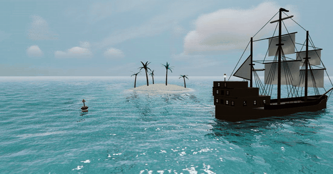
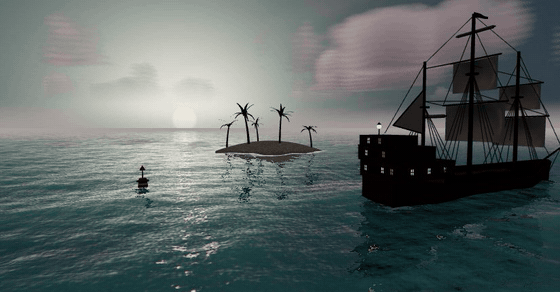
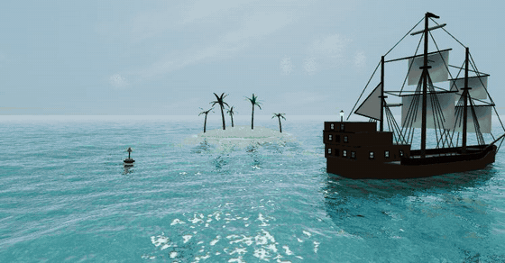
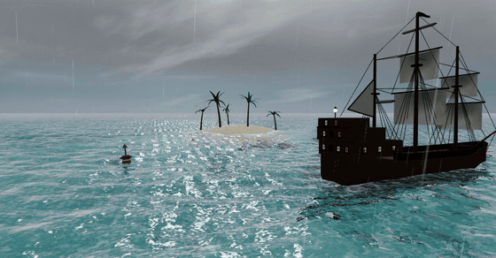
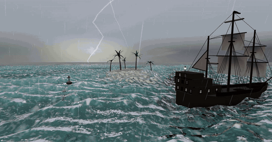

# Tideline

A procedural ocean & sky playground in a single HTML file. Everything is generated in shaders and code — no textures, no models, no network requests. Open `Tideline-Standalone.html` in any modern browser and you're sailing.



## Scenarios

| | |
|---|---|
|  |  |
|  |  |

Six sea states — **Calm, Azure, Golden, Rain, Storm, Tempest** — plus live sliders for wind, wave height, whitecaps, solar time, cloud cover and rain. Drag to orbit, scroll to zoom, and **dive below the surface** to explore the seabed.

## Features

**Water**
- Gerstner wave field (14 components, deep-water dispersion) with travelling group envelopes, so swells arrive in sets that build and dissolve
- Real planar reflections (mirrored scene render) and real screen-space refraction — the seabed, kelp and hull are visible through the surface
- Per-pixel analytic normals, Jacobian-based whitecaps, breaking shore wash, sun glitter, crest subsurface scattering
- Raindrop impact rings and splash crowns that ride the swell

**Sky**
- Physically-based Rayleigh/Mie scattering (adapted from the MIT-licensed [three.js `Sky` example](https://threejs.org/examples/#webgl_shaders_sky)) with full day/night cycle
- Raymarched volumetric cumulus with sun-shadowed cores, silver linings and wind drift
- Stars, milky way, moon, sun halo, cirrus veil
- Lightning: forked ribbon bolts with cloud-interior flashes, driven by heavy rain

**Underwater**
- Snell's-window surface seen from below, with clouds and sun glare refracted through the waves
- Procedural sandy seabed with animated caustics, stone pavement, swaying kelp, depth-based light absorption

**Scene**
- Procedural three-masted galleon (rigging web, billowed sails, lamplit stern gallery that flickers at night)
- Sand cay island with curved-trunk palms and boulders, continuous from beach to seabed
- Adaptive quality ladder so it stays interactive on integrated GPUs

## Running

The prebuilt **`Tideline-Standalone.html`** needs nothing — double-click it, works offline.

To hack on the source:

```bash
npm install
npm run build     # bundles src/ and regenerates Tideline-Standalone.html
npm run dev       # watch mode; serve index.html with any static server
```

`src/tideline.js` holds the ocean/sky/underwater engine and all the shaders; `src/galleon.js` and `src/flora.js` build the props.

## License

[MIT](LICENSE). All geometry and shading is procedural and original; the sky's scattering constants are adapted from the three.js `Sky` example (also MIT).
